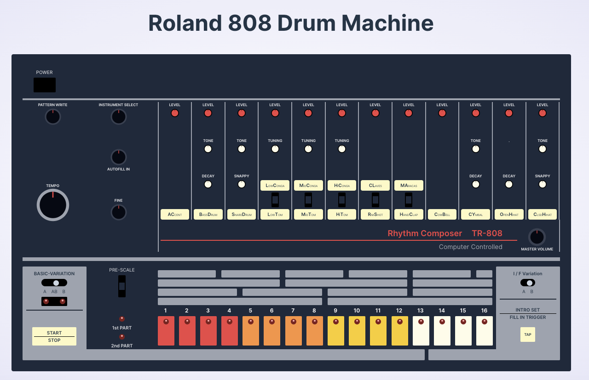

# HTML & CSS Roland 808 Drum Machine

This is a creative coding project to recreate the iconic Roland 808 drum machine released in 1980.  The sounds of this drum machine permeated multiple music genres including southern hip-hop and pop.  There is no mistaking the sound of that deep booming bass or the hard cracking snare 🔊.

The 808s are a bit too expensive to buy so I decided to create this digital one for all to enjoy.


## Screenshots




## Demo

Take a look at the drum machine in action [css-roland-808.netlify.app](https://css-roland-808.netlify.app/)


## Features

- Animation loop of the button light indicators illuminating signifying a drum loop.  Boom Bap Baby.


## Tech Stack

* HTML
* CSS (TailwindCSS)


## Roadmap

- [ ]  Responsiveness
- [ ]  Audio output with the Web Audio API
- [ ]  Clean up code (componentize more)
- [ ]  Fully functioning drum machine


## Run Locally

Clone the project

```bash
  git clone https://github.com/chadchristensen/css-roland-808.git
```

Go to the project directory

```bash
  cd css-roland-808
```

Install dependencies

```bash
  npm install
```

Start the server

```bash
  npm run dev
```

## Color Reference

| Color      | Hex                                                              |
| ---------- | ---------------------------------------------------------------- |
| 808 Red    |  #ef4444 |
| 808 Orange |  #fb923c |
| 808 Yellow |  #facc15 |
| 808 White  |  #fefce8 |